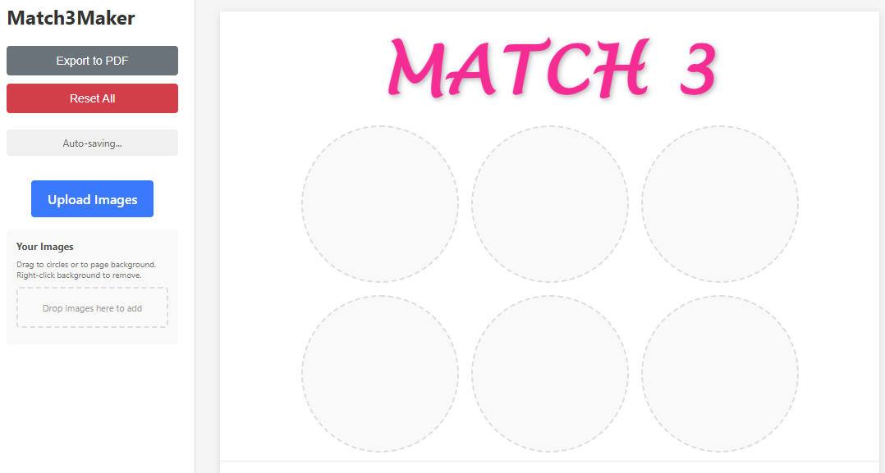

# Match3Maker

Match3Maker is a browser-based tool for building printable **"Match 3" scratch-sticker game sheets**. You upload your own images, drop them into circular slots (six per game, two games per page), fine-tune each image's zoom and position, add page backgrounds and editable titles, then export a print-ready **Letter-size PDF**.

Everything runs entirely in your browser — there is no server and no account. Your images, titles, and backgrounds are saved locally in the browser (via IndexedDB), so your work is still there when you come back.

## Live demo

Try it right now on GitHub Pages — no install required:

**https://speakinginbits.github.io/Match3-ScratchMaker/**

## Screenshots



## Features

- **Upload multiple images** at once into a reusable sidebar gallery.
- **Drag images** from the gallery onto any circle slot, or onto a page to set a full-page background.
- **Adjust each image** in a modal — drag to reposition and scroll (or use the slider) to zoom — before it's cropped into a circle.
- **Editable titles** — click a "MATCH 3" heading to rename it.
- **Two games per page**, six circles each (12 circles total).
- **Quick Cards** — pick two or more gallery images, optionally star a "match" image, choose a page count, and export a multi-page PDF of randomized cards in one click.
- **Export to PDF** at Letter size, ready to print.
- **Auto-save** — circles, gallery, backgrounds, and titles persist locally between sessions.
- **Reset All** to start over.

## How to use

1. Click **Upload Images** (or drop files into the gallery drop zone) to add images.
2. Drag an image from the gallery onto a circle. Adjust its zoom/position in the popup, then **Confirm**.
   - Or drag an image onto the top/bottom half of the page to set a **background**. Right-click a background to remove it.
3. Click a title to edit it.
4. Click **Export to PDF** to download a printable sheet.
5. Or click **Quick Cards** to batch-generate randomized sheets:
   - Select at least two gallery images. Click the ★ on one to make it the **match image** on every card; leave none starred to pick a random selected image per card.
   - Selected images show the circle that will be printed. Click the ✎ on one to adjust its zoom and position with the usual drag/scroll controls.
   - Choose how many pages you want (two cards per page) and click **Generate & Export PDF**.
   - Every card gets three copies of its match image plus three other selected images, shuffled into random positions. Your current titles and backgrounds are reused, and the editor is left untouched.

## Running locally

This is a static site — three files (`index.html`, `styles.css`, `app.js`) and no build step — so any static file server works. The two easiest options:

### Option A — VS Code + Live Server (recommended)

1. Install [Visual Studio Code](https://code.visualstudio.com/).
2. Install the **Live Server** extension (by Ritwick Dey) from the Extensions panel.
3. Clone or download this repository:
   ```bash
   git clone https://github.com/SpeakingInBits/Match3-ScratchMaker.git
   ```
4. Open the project folder in VS Code.
5. Right-click `index.html` and choose **"Open with Live Server"** (or click **Go Live** in the status bar).
6. Your browser opens the app at `http://127.0.0.1:5500/` (or a similar port).

### Option B — any static server

If you have Python or Node installed, from the project folder run one of:

```bash
# Python 3
python -m http.server 8000

# Node (npx, no install)
npx serve
```

Then open the printed URL (e.g. `http://localhost:8000`) in your browser.

> **Tip:** Serving over `http://` (Live Server or the commands above) is recommended rather than opening `index.html` directly as a `file://` path, so browser storage and PDF export behave consistently.

## Tech notes

- Plain HTML, CSS, and vanilla JavaScript — no framework or build tooling.
- Image cropping and preview use the HTML `<canvas>` API.
- PDF export uses [html2pdf.js](https://github.com/eKoopmans/html2pdf.js) (loaded from a CDN).
- Local persistence uses the browser's **IndexedDB**. Data is per-browser and per-device; clearing site data or using another browser starts fresh.
